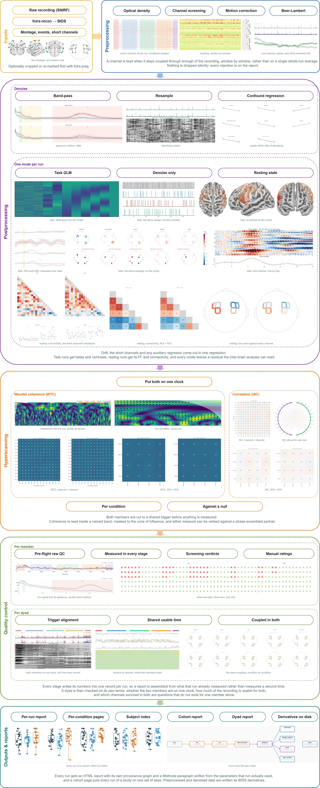

# fnirs-pipe

A BIDS-compatible fNIRS preprocessing, postprocessing, hyperscanning, and QC pipeline.

> **Status: in active development.** fnirs-pipe is changing quickly. Command-line options, output file names and defaults can change between releases without a deprecation period, so it is not yet recommended for production use. Pin a version for any analysis you intend to publish.

## Overview

`fnirs-pipe` runs two levels; dyad analysis is a separate tool, `fnirs-hyper`, which reads the tree `fnirs-pipe` wrote and writes its own:

| Level | What it does |
|-------|--------------|
| `participant` | `prep`: fixed-order preprocessing, OD conversion → windowed channel screening → motion correction (TDDR or wavelet) → Beer-Lambert. Then `post` when `--mode` is given: `denoise`, `glm`, or `rest` (bandpass + resample; confound regression; GLM residuals or ALFF/FC) |
| `group` | Cohort aggregation of the per-subject quality records, and of the per-dyad ones where the tree holds groups |

Outputs follow the [BIDS Derivatives](https://bids-specification.readthedocs.io/en/stable/derivatives/introduction.html) spec. Each run gets an HTML QC report with figures, a provenance graph and an auto-generated Methods paragraph, and each subject an index page over their runs. Cohort-level QC, hyperscanning (dyad WTC/ISC with phase-scrambled and re-paired nulls), an interactive rating viewer, a Dash desktop GUI, and a JSONL→SQLite run-log database are all first-class features.



## Requirements

- Python ≥ 3.10
- Every dependency is required and resolved by `pip install .`; what each one is for is in [`docs/getting-started/installation.md`](docs/getting-started/installation.md)

## Installation

```bash
git clone <repo>
cd fNIRS_pipe
pip install -e ".[dev]"
```

## Quick Start

Preprocessing only:

```bash
fnirs-pipe /data/bids /data/derivatives participant \
  --participant-label 01 02 \
  --dpf 6.0 --sci-threshold 0.8 \
  --cardiac-l-freq 0.7 --cardiac-h-freq 1.5 \
  --resp-l-freq 0.1 --resp-h-freq 0.5
```

Preprocessing + first-level GLM (events from SNIRF annotations by default):

```bash
fnirs-pipe /data/bids /data/derivatives participant \
  --participant-label 01 \
  --dpf 6.0 --sci-threshold 0.8 \
  --cardiac-l-freq 0.7 --cardiac-h-freq 1.5 \
  --resp-l-freq 0.1 --resp-h-freq 0.5 \
  --mode glm \
  --hrf-model spm --noise-model ar1 \
  --drift-model cosine --drift-high-pass 0.01 \
  --high-pass 0.01 --low-pass 0.5 \
  --short-channel mean
```

See [`docs/pipeline/common-scenarios.md`](docs/pipeline/common-scenarios.md) for resting-state, FIR GLM, paediatric, parallel, dry-run, and config-file examples. Per-command references live under [`docs/cli/`](docs/cli/), one page per `fnirs-*` entry point.

## CLI Reference

Entity flags are spelled the same on every command: `--participant-label`, `--session-label`, `--task-label`, `--run-label`, `--group-id`. A label may be given with its `sub-` / `ses-` / `task-` prefix or without. Every command takes `--version`.

Wherever a command takes a table from you (events, segments, the pairs file, `participants.tsv`), the extension decides the delimiter: `.tsv` is tab-separated, `.csv` comma-separated, and any other extension has its delimiter sniffed from the header. Option names such as `--pairs-csv` and `--events-path` say nothing about which format you must supply. Files the package writes back are always tab-separated, as BIDS requires.

### Channel screening

Four flags decide which channels survive, and they are the same on `fnirs-pipe`, `fnirs-qc prep-raw` and `fnirs-qc hyper-raw`:

- `--sci-threshold` and `--psp-threshold` define a *coupled window*: it has to clear both. PSP catches the movement that fakes a high SCI.
- `--min-good-frac` (default 0.75) is the criterion that actually rejects: the share of windows a channel has to be coupled in.
- `--screen-scope` picks which windows count: `run` (default) the whole recording, `task` only the annotated blocks, so the lead-in and the gaps between blocks do not count. `task` falls back to `run` when no annotation holds two windows.

`--window-length` (default 10 s) sets the window grid these, and the GVTD series, are measured on.

### `fnirs-pipe`

```
fnirs-pipe BIDS_DIR OUTPUT_DIR {participant,group} [OPTIONS]

Required at participant level:
  --dpf FLOAT [FLOAT ...]      Differential pathlength factor. One value or one per wavelength.
  --sci-threshold FLOAT        Scalp coupling index a window must reach (e.g. 0.8).
  --cardiac-l-freq FLOAT       Lower cardiac band bound in Hz (population-dependent, no default).
  --cardiac-h-freq FLOAT       Upper cardiac band bound in Hz.
  --resp-l-freq FLOAT          Lower respiration band bound in Hz (population-dependent, no default).
  --resp-h-freq FLOAT          Upper respiration band bound in Hz.

Subject / session / task selection:
  --participant-label LABEL [LABEL ...]   Space-separated or repeated.
  --session-label LABEL [LABEL ...]       Space-separated or repeated.
  --task-label LABEL [LABEL ...]          Space-separated or repeated.
  --bids-filter-file FILE      JSON file with extra pybids query filters.

Preprocessing:
  --motion-correction          {tddr,wavelet,spline,none}   [default: tddr]
                               tddr and wavelet are implemented; spline is withheld and is
                               refused at the start of the run.
  --bad-channels               S-D labels ("S1_D1,S2_D3") or a table with participant_id +
                               bad_channels columns. Either wavelength marks the pair.
                               Unioned with the screening's bads.
  --psp-threshold FLOAT        Peak spectral power a window must reach.           [default: 0.1]
  --min-good-frac FLOAT        Share of windows a channel must be coupled in.    [default: 0.75]
  --screen-scope               {run,task}  Which windows count toward it.         [default: run]
  --window-length FLOAT        Window (s) for the windowed SCI / PSP / GVTD series. [default: 10.0]
  --short-max-dist MM          Separation at or below which a channel is short. [default: 10]
                               Short channels see scalp only and are measured, and regressed,
                               separately from the long ones.
  --long-min-dist MM           Separation at or above which a channel is long. [default: 15]
                               A channel in the gap above --short-max-dist counts as neither
                               short nor long, joins no section, and is named in a run note.
  --long-max-dist MM           Separation above which a channel is too far to be long. Off by
                               default; set it on a montage carrying pairs too far apart to
                               trust.
  --epoch-tmin FLOAT           Trial window for the epoch figures and per-trial scoring,
  --epoch-tmax FLOAT           relative to each event onset. Both or neither. Omitted, the
                               figures use -5 to 25 s and the scoring uses each event's own
                               duration, which is what a block design records.
  --epoch-chunk-duration SEC   Cut each task annotation into trials this long before epoching,
                               so a block design gets one trial per piece. A 240 s block at
                               25 s gives 9 trials, remainder dropped.
  --epoch-single-trial         Draw the epoch section even when no condition repeats. Skipped
                               by default there, since one trial leaves nothing to average.
  --by-condition               One QC report page per annotated condition, as cond-<condition>.
                               Sliced out of the windowed pass already in the quality record, so
                               nothing is cut and nothing is measured again.
  --gvtd-censor [SET]          Mark the frames GVTD flags as BAD_gvtd annotations. Off by
                               default; takes the channel set to flag on, default long; `all`
                               also flags movement seen only on the short channels. Nothing is
                               cut: epoching drops the trials the spans overlap, continuous
                               analyses take what survives.
  --gvtd-censor-n-std FLOAT    Censoring threshold, in left-tail SDs above the GVTD mode.
                               [default: 10.0, the lenient value; the reports score at 3]
  --gvtd-min-epoch-s FLOAT     Shortest surviving stretch censoring keeps (s). Anything
                               shorter is censored with the artifacts around it. [default: 30.0]

Postprocessing mode:
  --mode                       {denoise,glm,rest}. Each fills in its own post defaults.
  --config FILE                TOML file of post settings and separation bands, over the
                               mode's defaults. CLI flags override both.

Filtering / resampling (all modes):
  --high-pass FLOAT            High-pass filter cutoff in Hz (e.g. 0.01).
  --low-pass  FLOAT            Low-pass filter cutoff in Hz (e.g. 0.5).
  --filter-method              {iir,fir}   [default: iir]
                               iir is a zero-phase Butterworth; fir is hamming-windowed
                               linear-phase and is refused when its
                               3.3 * sfreq / transition samples exceed the recording.
  --filter-order INT           Butterworth order, ignored by --filter-method fir. [default: 4]
                               Applied with filtfilt, so the rolloff is twice this and the
                               cutoff sits at -6 dB.
  --resample-sfreq FLOAT       Target sampling rate in Hz after filtering (e.g. 2.0).
  --combine-runs               Concatenate runs before postprocessing.

GLM (--mode glm):
  --hrf-model                  {spm,spm + derivative,spm + derivative + dispersion,
                                glover,glover + derivative,glover + derivative + dispersion,fir}
  --noise-model                ols | auto | arN                            [default: auto]
                               auto is an AR order of 4x the sampling rate. An order too low
                               for the sampling rate leaves a contrast's t values too large.
                               Honoured by every mode, not only glm.
  --drift-model                {cosine,polynomial,none}  Required by glm and rest; optional in
                               denoise, where the bandpass detrends.
  --drift-high-pass FLOAT      Cosine drift high-pass cutoff in Hz. No default: it has to sit
                               at or above --high-pass and below the rate a condition repeats
                               at, and the run warns when it does not.
  --drift-order INT            Polynomial drift order.                                [default: 1]
  --fir-delays STR             FIR delay bins in scans, e.g. "0,1,2,3,4,5"
  --short-channel              {none,mean,pca}  Refused on a montage with no short channel.
                               mean is one column per chromophore, pca one orthogonalised
                               column per short channel.                          [default: none]
  --fc                         Also write the connectivity products rest mode writes,
                               from the residual. Works in glm and denoise modes.
  --events-path FILE           Optional. BIDS *_events.tsv overriding SNIRF annotations.
                               Mutually exclusive with --stim-dur.
  --stim-dur FLOAT             Optional. Fixed duration for SNIRF annotations without one.
                               Mutually exclusive with --events-path.
  --contrast-file FILE         TOML file defining GLM contrasts.

Denoise (--mode denoise):
  Reuses GLM flags for confound regression (drift model, short-channel).
  Any one of them writes desc-errts; no task model, no resting-state derivatives.
  --fc adds the connectivity products, from the residual or from the bandpassed
  data itself when no regression was asked for.

Rest (--mode rest):
  Reuses GLM flags for confound regression (drift model, short-channel).
  --high-pass + --low-pass required for ALFF (FC computed regardless).

Output:
  --no-report                  Skip HTML QC report.
  --roi-mapping FILE           JSON mapping ROI labels to channel lists. Groups the denoising
                               carpet by ROI and enables ROI-level FC (rest mode).
  --n-jobs INT                 Parallel subject jobs.                                 [default: 1]
  --work-dir DIR               Hash cache directory (recorded; caching not yet implemented).

Escape hatches:
  --ignore ASPECT              Repeatable. Options: events, bids-validation.
  --skip-bids-validation
  --allow-cropped-input        Run on a `fnirs-prep crop` tree, otherwise refused. Motion
                               correction and the bandpass then each see one segment. Prefer
                               preprocessing the uncut recording and cropping the result.
  --dry-run                    Write each subject's run record and script, then stop.

Other:
  --verbose
  --version
```

`participant` preprocesses each subject, and postprocesses when `--mode` is given. `group` aggregates the per-subject quality records into `desc-subjects_qc.tsv` and `desc-subjects_report.html`, and, where the tree holds groups, the per-dyad ones into `desc-groups_qc.tsv` and `desc-groups_report.html`. Dyad analysis is `fnirs-hyper`, below.

### `fnirs-hyper`: dyad analysis

Dyad analysis is six commands. The two that read member recordings take the `fnirs-pipe` tree as input and write a separate hyper tree; the other four only re-read tables already in the hyper tree. `group` is the only analysis level, since every metric needs both members.

```
fnirs-hyper DERIVATIVES_DIR OUTPUT_DIR group --pairs-csv PATH
                [--group-id TEXT] [--task-label LABEL ...] [--desc TEXT]
                [--roi-mapping PATH]
                [--wtc-fmin/--wtc-fmax FLOAT]        [default: 0.004 / 0.20]
                [--wtc-band-fmin/--wtc-band-fmax FLOAT]
                [--wtc-significance] [--wtc-mc-count INT] [--wtc-seed INT]
                [--wtc-chroma {hbo,hbr,both}]        [default: both]
                [--wtc-mask-coi | --no-wtc-mask-coi] [--wtc-roi-min-channels N]
                [--wtc-arrow-min R]                  [default: 0.5]
                [--channel-cross] [--by-condition | --no-by-condition]
                [--wtc-window-s SECONDS]
                [--wtc-cond-transform] [--wtc-cond-pad-s SEC|auto]
                [--wtc-limit-scales | --no-wtc-limit-scales] [--wtc-save-maps]
                [--wtc-phase-null N] [--wtc-phase-null-cross]
                [--wtc-whiten SECONDS]
                [--isc-fmin/--isc-fmax HZ] [--isc-threshold FLOAT]
                [--isc-whiten ORDER] [--isc-max-lag SECONDS] [--isc-phase-null N]
                [--bads-scope {run,subject}] [--check-only] [--no-report]
                [--sci-threshold FLOAT]
                [--short-max-dist/--long-min-dist/--long-max-dist MM]
                [--normalize] [--no-align] [--tstart/--tend FLOAT]

fnirs-hyper-pairnull  DERIVATIVES_DIR OUTPUT_DIR group --pairs-csv PATH
                      [--group-id TEXT] [--task-label LABEL ...] [--desc TEXT]
                      [--roi-mapping PATH] [--bads-scope {run,subject}]
                      [--wtc-chroma {hbo,hbr,both}] [--wtc-pair-pool {position,any}]
                      [--wtc-pair-max N] [--wtc-pair-cross]
                      [--wtc-roi-min-channels N] [--wtc-limit-scales | --no-wtc-limit-scales]

fnirs-hyper-groupnull OUTPUT_DIR group --task TEXT [--wtc-chroma {hbo,hbr}]
                      [--null {repaired,phase}] [--roi-mapping PATH]
                      [--n-resample N] [--seed INT]

fnirs-hyper-band      OUTPUT_DIR group --wtc-band-fmin FLOAT --wtc-band-fmax FLOAT
                      [--wtc-mask-coi | --no-wtc-mask-coi] [--wtc-suffix TEXT]

fnirs-hyper-index     OUTPUT_DIR group [--group-id TEXT]

fnirs-hyper-merge     OUTPUT_DIR group
```

Keep `OUTPUT_DIR` apart from `DERIVATIVES_DIR`, so each tree carries its own `dataset_description.json`; the hyper tree records the source tree in `SourceDatasets`.

`fnirs-hyper` computes wavelet coherence and inter-subject correlation for each dyad in the pairs file, one report per group. A group of more than two gets one report, one set of figures and one ISC table per pairing, tagged `pair-<sub1>x<sub2>`, the transform still running once over the whole group. `--check-only` aligns each dyad, prints what the metrics would be computed on, and stops, which is how to check a cohort's channel budget before a long run. `--no-report` writes the tables and skips the HTML and its figures.

`--wtc-significance` draws `--wtc-mc-count` surrogate series per channel pair, 300 by default, and the runtime scales with that count. `--channel-cross` pairs every long channel with every other across the two brains, n² values instead of n, and adds the channel x channel matrix of band means, the ROI x ROI matrix under `--roi-mapping`, and a per-brain selector on each map panel. Every map carries relative phase as arrows, so a pair moving together is distinguishable from one moving together a few seconds apart; they are drawn against the null's per-frequency level where one exists, and above the flat `--wtc-arrow-min` where none does.

Per-condition results are on by default: the coherence is read out of each task annotation's own window, one result per block, and `--no-by-condition` turns that off. Each window is read off the whole-run transform rather than transformed on its own, so it costs almost nothing and a short condition is not inflated by its own edges. `--wtc-cond-transform` transforms each condition separately instead, keeping `--wtc-cond-pad-s` seconds either side and windowing them back off; with the `auto` margin the numbers match the default route. `--wtc-limit-scales`, on by default, computes only the scales inside the band plus margin, bit for bit identical to the unrestricted transform. `--wtc-window-s` cuts every condition into non-overlapping windows of that length and makes the window the unit, so conditions of different length estimate the same thing.

`--wtc-chroma` picks the chromophore(s), both by default: two parallel passes, HbO pairing only with HbO, so nothing is mixed and the cost is exactly twice. Read HbR as a consistency check on HbO rather than a second result. One switch moves every panel between them, and every band-mean table carries a `chromophore` column.

`--wtc-phase-null N` adds the phase-scrambled null: the same band means against a phase-scrambled partner, averaged over N iterations. It is what a real value is read against, and each iteration is a full WTC run. It shares this run's stage, band and window, and follows `--by-condition`'s windows at no extra transform. Crossing is the one thing it does not share, being paid on every iteration; ask for it with `--wtc-phase-null-cross`. Each null table carries `null_sd`, `null_p95`, `n_iter` and each cell's `percentile`.

`--wtc-whiten SECONDS` prewhitens each long channel with an autoregressive model of that many seconds of order before the coherence, one order for every channel of both members. Off by default; the phase-scrambled null follows it and the sidecars record it.

The correlation side has its own flags, all off by default. `--isc-fmin` / `--isc-fmax` band-limit each member before the correlation; without them ISC reads whatever the preprocessing passband left, and the run warns when that differs from the WTC band. `--isc-whiten ORDER` correlates autoregressive residuals rather than the series, putting r back on the scale its sample count implies; it shrinks r substantially, so a whitened matrix does not compare with an unwhitened one. `--isc-max-lag SECONDS` keeps the strongest correlation over every shift within that many seconds either way and reports the winning shift. `--isc-phase-null N` ranks each correlation against N phase-scrambled surrogates, the null a maximum over many shifts needs. All of them write into the long `stat-isc_relmat.tsv`, one row per channel pair. `--isc-threshold` forces an absolute cut on the connectogram; left alone, a chord is drawn where the pairing beats its own null, or for the strongest tenth when none was drawn.

`fnirs-hyper-pairnull` is the second null: each member's coherence against people they never interacted with, drawn from the other groups of the same task. A re-paired partner did the same task, so what survives is coupling beyond what the shared task explains. It needs a cohort, reads its band, mask, frequency range and window off the real tables, and so runs after `fnirs-hyper`. `--wtc-pair-pool position` (the default) replaces a member only with another group's member at the same index, which is the only safe pool when one person appears in several groups. The next `fnirs-hyper` run picks up its per-condition arrow levels.

`fnirs-hyper-groupnull` averages the channels first and ranks that mean against the draws, once per occasion and once over the cohort. It cannot say which channel, but can say whether the pairing beats its null at all. It reads the draws `fnirs-hyper-pairnull` (or `--wtc-phase-null`) wrote and runs no transform.

`fnirs-hyper-band` re-averages the maps `fnirs-hyper --wtc-save-maps` saved over a different band, with no second wavelet transform, taking the same `--wtc-band-fmin` / `--wtc-band-fmax` / `--wtc-mask-coi` as `fnirs-hyper`. Its tables carry a `band-` entity and sit beside the originals.

`fnirs-hyper-index` rebuilds `group-<id>_desc-index_report.html`, one row per analysed window. `fnirs-hyper` writes it too; this is for a tree produced earlier, or after the pages were regenerated by hand.

`fnirs-hyper-merge` concatenates every per-dyad table into one per kind at the root of the tree, adding `group_id` and `task` columns, so a cohort analysis reads one file. It refuses to merge tables that disagree on the band, on the cone-of-influence masking, on which null they are or on the stand-in pool, crossed tables with homologous ones, and matrices over different channels. A differing null iteration count only warns, `n_iter` being kept per row.

### `fnirs-recon`: raw SNIRF → BIDS

```
fnirs-recon INPUT_FILE BIDS_DIR --participant-label LABEL --task-label LABEL
                                [--session-label LABEL] [--run-label INDEX]
                                [--optode-frame {unknown,head,mri}]
                                [--overwrite]
```

`--optode-frame` names the space the SNIRF's optode coordinates were measured in. SNIRF does not record it, and without it no `_optodes.tsv` or `_coordsystem.json` is written, both of which BIDS requires. Use `head` for positions digitised against the nasion and preauricular points.

### `fnirs-prep`: headless data-preparation utilities

```
fnirs-prep crop BIDS_DIR OUTPUT_DIR --participant-label SUB ...
                ( --tmin FLOAT [--tmax FLOAT] | --segments-path PATH [--combine] )
                [--align none|trigger] [--trigger-name TEXT]
                [--margin SEC|auto] [--band-fmin HZ] [--input-desc DESC]
                [--session-label / --task-label / --run-label]
                [--n-jobs INT] [--skip-bids-validation]

fnirs-prep align BIDS_DIR OUTPUT_DIR --group-csv PATH
                 [--skip-bids-validation]

fnirs-prep edit-markers export BIDS_DIR OUT_DIR --participant-label SUB ...
                               [--session-label / --task-label / --run-label] [--n-jobs INT]

fnirs-prep edit-markers apply BIDS_DIR OUTPUT_DIR --participant-label SUB ...
                              ( --tsv PATH | --shift FLOAT | --set-duration FLOAT
                                | --rename OLD:NEW ... )
                              [--session-label / --task-label / --run-label] [--n-jobs INT]
```

Each command writes a new tree under `OUTPUT_DIR` (`cropped/`, `aligned/`, `marker_edited/`) with its own `dataset_description.json`, so point it at a derivatives root rather than at one dataset.

`crop` takes its window from `--tmin` / `--tmax` or from a segments table passed to `--segments-path`, which holds `onset` and `duration`. Each segment written to its own file is named by a `task` column, which more than one segment needs unless `--combine` is given; the table is checked once before any subject, so a bad one is one error and writes nothing. Under `--align trigger`, times are measured from the first annotation named by `--trigger-name`, so one window selects the same stretch of task in every subject.

`align` puts every member of a group on one clock by their shared trigger and records each member's offset in its own `_nirs.json`. A member two groups share is refused rather than silently re-cut by the second group.

`--margin` keeps extra seconds either side of every segment and records the span asked for in the sidecar: a segment cut to its own boundaries cannot be analysed at those boundaries by anything that convolves. `auto` takes the width from `--band-fmin`, the lowest frequency the later analysis will average over.

`--input-desc` cuts a processed stage instead of a recording (`errts`, `filtered`, and so on), `BIDS_DIR` then being a derivatives tree. This is the order to prefer: cutting first makes motion correction and the bandpass each see one condition.

### `fnirs-qc`: QC reports

`prep-raw` and `hyper-raw` read raw recordings, so both require `--cardiac-l-freq` / `--cardiac-h-freq`, population-dependent and without a default, and `--dpf`, used to convert to haemoglobin internally. Both screen channels and split the montage, so both take the same screening and separation flags as `fnirs-pipe`; pass what the run was prepped with.

```
fnirs-qc prep-raw BIDS_DIR OUTPUT_DIR --participant-label LABEL [LABEL ...]
                  --dpf FLOAT [FLOAT ...]
                  --cardiac-l-freq FLOAT --cardiac-h-freq FLOAT
                  [--session-label / --task-label]
                  [--sci-threshold FLOAT] [--psp-threshold FLOAT]
                  [--min-good-frac FLOAT]                        [default: 0.75]
                  [--screen-scope {run,task}]                    [default: run]
                  [--window-length FLOAT]                        [default: 10.0]
                  [--epoch-qc] [--epoch-tmin/--epoch-tmax FLOAT]
                  [--by-condition]
                  [--motion-correction {tddr,wavelet,spline,none}]  [default: none]
                  [--short-max-dist/--long-min-dist/--long-max-dist MM]
                  [--skip-bids-validation]

fnirs-qc hyper-raw BIDS_DIR OUTPUT_DIR group --pairs-csv PATH
                   --dpf FLOAT [FLOAT ...]
                   --cardiac-l-freq FLOAT --cardiac-h-freq FLOAT
                   [--group-id / --task-label / --session-label]
                   [--sci-threshold FLOAT] [--psp-threshold FLOAT]
                   [--min-good-frac FLOAT] [--screen-scope {run,task}]
                   [--coh-fmin/--coh-fmax FLOAT]                 [default: 0.01 / 0.10]
                   [--short-max-dist/--long-min-dist/--long-max-dist MM]
                   [--normalize] [--no-align] [--tstart/--tend FLOAT]
                   [--derivatives-dir DIR]

fnirs-qc cohort       OUTPUT_DIR
fnirs-qc cohort-hyper OUTPUT_DIR
fnirs-qc provenance   OUTPUT_DIR
```

`prep-raw` takes more than one subject, one subject's failure does not stop the rest, and it writes the subject index too. Its report is `sub-<id>_task-<t>_desc-raw_report.html` beside the pipeline's own. Its `--by-condition` writes one page per annotated condition, `sub-<id>_task-<t>_cond-<label>_desc-raw_report.html`, keeping the run's own task. Its `--motion-correction` runs that correction on a copy of the optical density and reports the recording either side of it, writing nothing back, so the screening verdict still describes the recording as delivered.

`hyper-raw` writes into the hyper tree, the same one `fnirs-hyper` writes, as `group-<id>/group-<id>_task-<t>_desc-raw_report.html`. `--derivatives-dir` names the fnirs-pipe tree, from which its motion panel draws each member's recording after motion correction; without it the panel shows the recordings before correction only, and it refuses an output directory that is that tree. Its per-subject quality table is the long-channel view the individual reports print, so a subject's SCI, CV, SNR and GVTD can be read against their own raw page.

`cohort` puts every subject in a tree on one page (`desc-subjects_report.html`). `cohort-hyper` is about dyads (`desc-groups_report.html`): how much of each recording both members could use at the same moment, split into one member's loss and the shared loss; where that time went, per channel pair and per condition; and each window's coherence as its rank inside its own null. It reads the records `hyper-raw` writes. `provenance` redraws the graphs from the sidecars already on disk.

For a cohort report over one time window, crop first and then run the usual pair of commands:

```
fnirs-prep crop BIDS_DIR DERIV_DIR --participant-label ... --tmin FLOAT --tmax FLOAT
                [--align none|trigger] [--trigger-name TEXT]
fnirs-qc   prep-raw DERIV_DIR/cropped OUTPUT_DIR --participant-label LABEL ... --dpf ...
                    --cardiac-l-freq FLOAT --cardiac-h-freq FLOAT
fnirs-qc   cohort OUTPUT_DIR
```

### `fnirs-rate`: Flask rating viewers

```
fnirs-rate rate  OUTPUT_DIR [--participant-label SUB ...] [--port INT]   # default 8765
fnirs-rate raw   OUTPUT_DIR --participant-label SUB
                 [--session-label / --task-label] [--sci-threshold FLOAT] [--port INT]   # default 5052
fnirs-rate hyper OUTPUT_DIR --group-id GROUP_ID --task-label TASK_LABEL --pairs-csv PATH
                 [--session-label TEXT] [--sci-threshold FLOAT] [--port INT]             # default 5053
                 [--derivatives-dir DIR]
```

Ratings and channel decisions are written into the subject's `nirs/` folder, one file per rated page (`desc-rating_qc.json`, `desc-rawrating_qc.json`) and one per run (`desc-rawdecision_qc.json`), with append-only logs in `logs/group_ratings.jsonl` and `logs/group_raw_ratings.jsonl`. A rerun of the pipeline never overwrites them. `fnirs-rate hyper` serves the report in the fnirs-hyper tree; `--derivatives-dir` names the fnirs-pipe tree, so each member's channel decisions land in the file their own raw page reads.

### `fnirs-gui`: Dash desktop interface

```
fnirs-gui [--port INT]        # default 8050, or the next free port above it
```

### `fnirs-log`: JSONL → SQLite run-log database

```
fnirs-log merge   OUTPUT_DIR [--db-path PATH]
fnirs-log rebuild OUTPUT_DIR [--db-path PATH]
```

`merge` adds every finished execution's JSONL logs to the database, backing the database up to `logs/backup/` first and moving the merged logs to `archived/`, so a second merge adds nothing. `rebuild` builds a new, timestamped database from every log, archived ones included, and leaves the existing database untouched.

Full per-command references (parameter tables, examples, sidecar formats) live in [`docs/cli/`](docs/cli/).

## Output Structure

Every name is built from BIDS entities: `desc-` is the processing stage, `stat-` the measure, `chromo-` the chromophore, `seg-` / `agg-` the ROI definition and how it aggregates, `cond-` a condition, `null-` which null a table holds, `pair-` a pairing inside a group of more than two. The suffix says what shape the file holds: `nirs` a signal, `relmat` a relation between channels or ROIs, `nirsmap` one value per channel or ROI, `qc` quality numbers, `report` a rendered page. An entity appears only where it tells two otherwise identical files apart.

`fnirs-pipe` tree:

```
derivatives/fnirs-pipe/
├── dataset_description.json
├── .bidsignore                          # reports, logs, figures, JSON-only records
├── desc-subjects_qc.tsv                 # fnirs-qc cohort / fnirs-pipe group
├── desc-subjects_report.html
├── logs/
│   ├── json/                            # JSONL event stream, moved to archived/ once merged
│   │   ├── _pipeline/
│   │   ├── _runs/
│   │   └── _sqm/
│   └── fnirs_pipe.db                    # SQLite, after fnirs-log merge
└── sub-01/
    ├── sub-01_desc-index_report.html               # index over the subject's runs
    ├── sub-01_task-<t>_report.html                 # QC report, one per run
    ├── sub-01_task-<t>_cond-<c>_report.html        # + --by-condition, one per condition
    ├── sub-01_task-<t>_desc-raw_report.html        # fnirs-qc prep-raw
    ├── sub-01_task-<t>_desc-mne_report.html        # MNE's own report of the run
    ├── figures/                                    # one flat folder, entities name each figure
    │   ├── sub-01_task-<t>_desc-provenance_nirs.png
    │   ├── sub-01_task-<t>_desc-provenance_nirs.mmd
    │   └── ...
    ├── logs/
    │   ├── sub-01.log
    │   ├── sub-01.toml                             # run record (env + params)
    │   └── sub-01_script.py                        # reproduction script
    └── nirs/                                       # every data file has a .json sidecar
        ├── sub-01_task-<t>_desc-od_nirs.snirf              # prep 1: optical density
        ├── sub-01_task-<t>_desc-sci_nirs.snirf             # prep 2: channel screening
        ├── sub-01_task-<t>_desc-motcorrected_nirs.snirf    # prep 3: motion correction
        ├── sub-01_task-<t>_desc-preproc_nirs.snirf         # prep 4: Beer-Lambert (terminus)
        ├── sub-01_task-<t>_desc-filtered_nirs.snirf        # post: bandpass
        ├── sub-01_task-<t>_desc-resampled_nirs.snirf       # post: + --resample-sfreq
        ├── sub-01_task-<t>_desc-errts_nirs.snirf           # post: confound-regression residual
        ├── sub-01_task-<t>_desc-errtsbroad_nirs.snirf      # rest: un-bandpassed residual, ALFF input
        ├── sub-01_task-<t>_desc-aux_timeseries.tsv.gz      # aux channels, if the file had any
        ├── sub-01_task-<t>_desc-sqm_qc.json                # quality record, one per run
        ├── sub-01_task-<t>_desc-channel_qc.tsv             # per-channel metrics and verdicts
        ├── sub-01_task-<t>_design.tsv                      # design matrix
        ├── sub-01_task-<t>_desc-glm_nirsmap.tsv            # GLM estimates per channel
        ├── sub-01_task-<t>_desc-contrast_nirsmap.tsv       # glm + --contrast-file
        ├── sub-01_task-<t>_stat-alff_nirsmap.tsv           # rest: ALFF / fALFF per channel
        ├── sub-01_task-<t>_seg-<roi>_agg-roi_stat-alff_nirsmap.tsv            # + --roi-mapping
        ├── sub-01_task-<t>_chromo-hbo_stat-pearson_relmat.tsv                 # FC, channel x channel
        ├── sub-01_task-<t>_chromo-hbo_stat-fisherz_relmat.tsv                 # Fisher z of the above
        ├── sub-01_task-<t>_chromo-hbo_seg-<roi>_agg-roi_stat-pearson_relmat.tsv   # + --roi-mapping, ROI x ROI
        ├── sub-01_task-<t>_chromo-hbo_seg-<roi>_agg-seed_stat-pearson_relmat.tsv  # + --roi-mapping, ROI x channel
        └── ...                                     # the same for chromo-hbr and each fisherz
```

The `relmat` and `stat-alff` files are written in rest mode, or in any mode run with `--fc`. `seg-<roi>` is the ROI mapping file's stem. Ratings and channel decisions from `fnirs-rate` land in the same `nirs/` folder as `desc-rating_qc.json`, `desc-rawrating_qc.json` and `desc-rawdecision_qc.json`.

`fnirs-hyper` tree, which `fnirs-qc hyper-raw`, `fnirs-hyper-pairnull` and the other hyper commands write into as well:

```
derivatives/fnirs-hyper/
├── dataset_description.json             # SourceDatasets names the fnirs-pipe tree
├── .bidsignore
├── desc-groups_qc.tsv                   # fnirs-qc cohort-hyper
├── desc-groups_report.html
├── stat-wtc_relmat.tsv                  # fnirs-hyper-merge: every dyad in one table per kind
├── stat-isc_relmat.tsv
├── ...
└── group-G01/
    ├── group-G01_desc-index_report.html           # one row per analysed window
    ├── group-G01_task-<t>_report.html             # dyad report
    ├── group-G01_task-<t>_cond-<c>_report.html    # one per condition
    ├── group-G01_task-<t>_desc-raw_report.html    # fnirs-qc hyper-raw
    ├── figures/
    ├── logs/group-G01_task-<t>.toml
    └── nirs/                                      # every table has a .json sidecar
        ├── group-G01_task-<t>_stat-wtc_relmat.tsv                 # band means, one row per channel pair
        ├── group-G01_task-<t>_cond-all_stat-wtc_relmat.tsv        # the same, one row per condition window
        ├── group-G01_task-<t>_stat-wtcphase_relmat.tsv            # relative phase and lag, per frequency
        ├── group-G01_task-<t>_seg-<roi>_agg-homologous_stat-wtc_relmat.tsv  # + --roi-mapping
        ├── group-G01_task-<t>_null-phase_stat-wtc_relmat.tsv      # + --wtc-phase-null
        ├── group-G01_task-<t>_null-pair_stat-wtc_relmat.tsv       # fnirs-hyper-pairnull
        ├── group-G01_task-<t>_cond-all_null-pair_stat-wtc_desc-draws_relmat.tsv  # every draw
        ├── group-G01_task-<t>_chromo-hbo_stat-wtc_relmat.npz      # + --wtc-save-maps
        ├── group-G01_task-<t>_chromo-hbo_band-<band>_stat-wtc_relmat.tsv  # fnirs-hyper-band
        ├── group-G01_task-<t>_chromo-hbo_stat-isc_relmat.tsv      # ISC matrix, per chromophore
        ├── group-G01_task-<t>_stat-isc_relmat.tsv                 # ISC, one row per channel pair
        ├── group-G01_task-<t>_desc-usable_qc.tsv                  # shared usable time
        ├── group-G01_task-<t>_desc-subject_qc.tsv                 # per-member quality
        ├── group-G01_task-<t>_desc-channel_qc.tsv
        └── group-G01_task-<t>_desc-bad_qc.tsv
```

Long tables (WTC band means, the ISC pair table, ALFF) carry a `chromophore` column; wide matrices take `chromo-` in the name instead. A group of more than two members writes one report and one set of pairwise tables per pairing, tagged `pair-<sub1>x<sub2>`. `fnirs-hyper-merge` writes each merged table under the per-dyad name with `group-` and `task-` dropped, since the merged table spans every group and task.

## QC Reports

`fnirs-pipe` writes an HTML report per run automatically, plus an index page per subject; `fnirs-qc` adds standalone, cohort, and hyperscanning reports:

| Report | Command | Level / stage |
|--------|---------|---------------|
| Per-run | (pipeline, automatic) | individual: raw + post, one report per run plus a subject index |
| Per-condition | `--by-condition`, pipeline or `prep-raw` | individual: one page per annotated condition |
| Raw pre-flight viewer | `fnirs-qc prep-raw` | individual: raw only |
| Cohort | `fnirs-qc cohort` or `fnirs-pipe group` | cohort: every subject in a tree |
| Dyad cohort | `fnirs-qc cohort-hyper` | cohort: every dyad in a tree |
| Time-window cohort | `fnirs-prep crop` then `prep-raw` + `cohort` | cohort: raw, cropped window |
| Per-trial | `fnirs-qc prep-raw --epoch-qc` | individual: SQM per task event, in the raw report |
| Dyad raw | `fnirs-qc hyper-raw` | hyperscanning: raw coherence |
| Dyad post | `fnirs-hyper` | hyperscanning, post: WTC + ISC (ROI-level with `--roi-mapping`), one page per condition |
| Dyad index | `fnirs-hyper` / `fnirs-hyper-index` | hyperscanning: one row per analysed window |

### Per-run report contents

- Executive summary with traffic-light badges (bad channel rate, mean SCI, HbO–HbR corr, GVTD p95), and a metrics panel whose tooltips say which stage each number was measured on
- SCI / PSP probe layout + windowed heatmap, coloured by the screening's verdict
- Carpet plot before / after motion correction, with the spike spans and the correction footprint drawn beneath. The GVTD trace covers the long channels, the set `--long-min-dist` / `--long-max-dist` define, and names its channel set and count on the figure; censored spans, if any, are drawn over it
- Per-channel motion panel with SCI-coloured traces
- PSD before / after bandpass (cardiac + Mayer wave peaks annotated)
- HbO–HbR correlation panel
- Topographic maps of the condition-averaged response, at time points after onset, for task data
- Trial images, split by condition, ROI-averaged and per channel, for task data
- Denoising carpet, before / after, HbO and HbR separately, both scaled by the pre-denoising SD (grouped by ROI with `--roi-mapping`), when postprocessing runs
- Global correlation (`gcor`) before → after denoising when postprocessing runs
- GLM section (design matrix + activation panel) when `--mode glm`
- Rest section (ALFF and fALFF as bars and on the optode layout, FC heatmap, connectogram, ROI-to-ROI matrix and seed topography with `--roi-mapping`) when `--mode rest`, or in any mode run with `--fc`
- The run's provenance graph and a table of every output with the step that made it
- Auto-generated Methods paragraph + software versions + references

Cohort and window reports add subject × metric heatmaps, per-scale grouped boxplots with clickable strip points (Tukey 1.5 × IQR outliers), and sortable tables. Dyad reports carry the coherence maps and matrices, the ISC matrix and its connectogram, the motion figures either side of correction, the usable-time breakdown, and one table holding every number behind the panels.

## Package Structure

```
fnirs_pipe/
  cli/          fnirs-pipe, fnirs-recon, fnirs-prep, fnirs-qc, fnirs-hyper (and its five
                companions), fnirs-rate, fnirs-gui, fnirs-log
  pipeline/     prep_pipeline, post_pipeline, glm, ar_irls, denoise, restingstate, motion,
                crop, edit_markers
    hyper/      alignment, wtc, isc, coherence, whiten, surrogate, roi, hyper_post,
                wtc_store, wtc_null, wtc_aggregate, pair_null, pair_null_group,
                group_io, group_quality
  io/           BIDS layout, output naming (BIDS entities), snirf read/write,
                derivatives output, snirf aux group, delimiter-sniffing table reader
  data/         pybids config declaring the package's entities and path patterns
  qc/
    common/     report shell, channel table, provenance graph, window grid, figure IO
    metrics/    coupling, screening, motion, GVTD, haemoglobin, windowed, hyper, aggregate
    figures/    Plotly and matplotlib panels, split common / subject / hyper
    subject/    per-run report, condition pages, subject index, SQM record, trial QC,
                cohort writer
    hyper/      dyad raw and post reports, dyad index, usable time, cohort-hyper writer
    rating/     Flask rating apps
    boilerplate/  Methods text and references
  interface/    Dash GUI (analysis, batch prep, data prep, hyper align, hyper analysis,
                qc, recon)
  utils/        logging, run_record, job_db, lineage, run_script, snirf_prep, net
  exceptions.py AlignmentError, GroupCSVError, MissingDerivativesError, StageError, ...
```

## Documentation

See [`docs/`](docs/) for the full handbook: installation, quickstart, configuration, per-command references, QC anatomy, hyperscanning, GUI, and the logging + database subsystem.

## Development

```bash
pip install -e ".[dev]"
pytest
```

See [ROADMAP.md](ROADMAP.md) for planned features and [CHANGELOG.md](CHANGELOG.md) for release history.

## Citation

> *fnirs-pipe is in active development. Citation instructions will be added at first stable release.*
